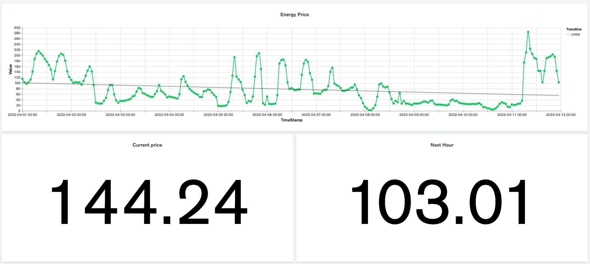

# MongoDB Meetup
### April 2022

## Introduction

Nobody has missed the increasing energy prices. With the help of data we can plan our consumption and save money.

This guide will go over how you can fetch energy price data and store that in MongoDB Atlas Cluster, it will guide you through the process of creating live charts to visualize and gain insights from that data using MongoDB Atlas Charts.

### What we will build

During this session we will create a dashboard using MongoDB Atlas Charts showing energy price over time and insights around the price.

## Prerequisites

* MongoDB Atlas cluster
    *  Free [Sign up](https://www.mongodb.com/cloud/atlas/register2)

* Data
    * Data will be fetched using the following URL:  
    `https://www.vattenfall.se/api/price/spot/pricearea/<yyyy-mm-dd>/<yyyy-mm-dd>/SN3`  
    This will fetch data between dates and price area SN3.  
    Example fetch can be found in [REST_playground.rest](REST_playground.rest) file. 

## Steps

### 1. Get the data
- Using [Python](GET_DATA_PYTHON.py)
- Using [Nodejs](GET_DATA_NODEJS.js)

### 2. Import data to MongoDB Atlas
- Using [mongoimport](mongoimport.md)
- Using Compass
- Using Python
- Using Nodejs

### 3. Explore the data
- Using Compass
- Using Atlas

### 4. MongoDB Atlas Charts
- Data sources
- Data sources pipeline
- Dashboard/Charts

### 5. Putting it all together
- Charts EmbeddSDK
